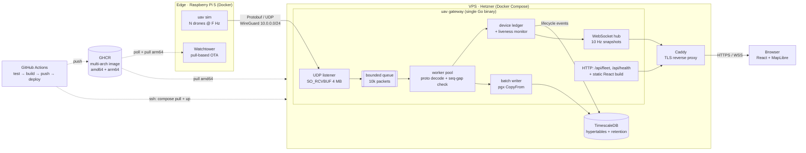
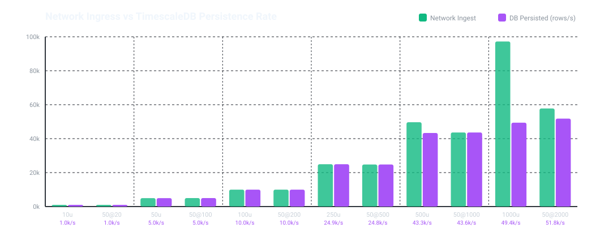

# UAV Lab

End-to-end telemetry pipeline for a simulated UAV fleet: an edge node (Raspberry Pi 5) streams Protobuf telemetry over a WireGuard tunnel to a Go gateway on a VPS, which persists it to TimescaleDB and pushes a live fleet view to a web dashboard.

It's a side project to learn robotics middleware, telemetry links over unreliable networks, and edge-to-cloud systems.

**Live demo → [uav.manex.dev](https://uav.manex.dev)** · REST snapshot: [`/api/fleet`](https://uav.manex.dev/api/fleet)

<!-- TODO: add docs/demo.gif (map + fleet ledger + a drone going OFFLINE) -->

---

## Architecture



### Data path

1. **Edge** – `uav sim` runs a fleet of simulated drones (kinematics, attitude, LiPo discharge, flight modes) and sends one `TelemetryRecord` ([`proto/telemetry/v1/telemetry.proto`](proto/telemetry/v1/telemetry.proto)) per datagram, with a per-device `sequence_number` and an edge timestamp in nanoseconds.
2. **Transport** – Plain UDP inside a WireGuard tunnel. The gateway binds the UDP port only on the VPN interface (`10.0.0.1`), so the ingest socket is never exposed to the internet.
3. **Ingest** – One socket reader pushes raw datagrams into a bounded channel. A worker pool decodes them, detects sequence gaps (packet loss) and fans out to the ledger and the batch writer. If the queue is full, packets are dropped instead of blocking the socket.
4. **State** – The in-memory device ledger tracks the latest state per drone. A liveness monitor marks a device `OFFLINE` after 3 s without telemetry and records the transition in `device_events`.
5. **Persistence** – Records are batched (1000 rows or 100 ms) and written with `pgx.CopyFrom` into a TimescaleDB hypertable (2 h chunks, 3-day retention). Migrations run on startup with goose.
6. **Presentation** – A WebSocket hub broadcasts fleet snapshots at 10 Hz plus lifecycle events. The same Go binary serves the React/MapLibre build, and Caddy terminates TLS.
7. **Delivery** – Every push to `main` runs tests against a real TimescaleDB service, builds a multi-arch image to GHCR and redeploys the VPS over SSH. The Pi picks up the new image through Watchtower.

### Design decisions

| Decision | Why |
| :--- | :--- |
| UDP instead of TCP/MQTT for telemetry | High-rate state where the latest sample matters more than retransmitting an old one. Loss is measured through sequence numbers instead of hidden by retries. |
| Protobuf | Typed, versioned contract shared by the edge and the cloud, with compact datagrams (~180 B). |
| WireGuard instead of TLS on the ingest path | Authenticates and encrypts the whole edge link with a single static config, and keeps the UDP port off the public internet. |
| Bounded queues that drop on overflow | Ingest must never stall because the database is slow. Drops are counted and exposed. |
| `CopyFrom` batches | Uses the Postgres COPY protocol: one round-trip per batch instead of one per row. |
| Single Go binary (`uav gateway \| sim \| monitor \| db`) | One image for edge and cloud, so the same artifact is tested and deployed everywhere. |

---

## Benchmarks

Ingest and persistence were measured on localhost (8 cores, TimescaleDB in Docker) by sweeping fleet size and per-drone frequency. Full report: [`benchmarks/runs/20260912_173433_baseline/REPORT.md`](benchmarks/runs/20260912_173433_baseline/REPORT.md).

| Load | Received | p50 latency | UDP loss | DB rows/s |
| :--- | ---: | ---: | ---: | ---: |
| 100 drones @ 100 Hz | 9,963 msg/s | 0.68 ms | 0.00 % | 9,963 |
| 250 drones @ 100 Hz | 24,931 msg/s | 0.68 ms | 0.00 % | 24,931 |
| 500 drones @ 100 Hz | 49,669 msg/s | 0.85 ms | 0.04 % | 43,322 |
| 1000 drones @ 100 Hz | 97,223 msg/s | 1.73 ms | 0.30 % | 49,386 |

The UDP path holds up to about 100k msg/s. The single TimescaleDB node is the bottleneck at around 40–50k rows/s, and beyond that the batch writer drops rows rather than back-pressuring the socket.



> Latency here is sender→gateway on the same host (shared clock). Across the Pi and the VPS it depends on NTP sync and isn't comparable.

---

## Running locally

Requirements: Go 1.24+, Node 22+, Docker.

```bash
make db-up                         # TimescaleDB in Docker
make dev                           # gateway: UDP :9876, HTTP/WS :8080
make swarm drones=20 hz=50         # simulated fleet → localhost:9876
make web-dev                       # Vite dev server for the dashboard
make monitor                       # optional terminal UI (Bubble Tea)
```

Other targets: `make test` (with `-race`), `make benchmark`, `make help`.

### Deployment

| Where | File | Notes |
| :--- | :--- | :--- |
| VPS | [`docker-compose.prod.yml`](docker-compose.prod.yml) + [`.env.example`](.env.example) | Gateway + TimescaleDB, behind an external Caddy network. |
| Raspberry Pi | [`docker-compose.edge.yml`](docker-compose.edge.yml) + [`.env.edge.example`](.env.edge.example) | Simulator + Watchtower. Needs the WireGuard peer up. |
| CI/CD | [`.github/workflows/deploy.yml`](.github/workflows/deploy.yml) | test → GHCR (amd64/arm64) → SSH deploy. |

---

## Repository layout

```text
cmd/uav/            single CLI entrypoint (cobra)
internal/ingest/    UDP listener, worker pool, metrics
internal/ledger/    device registry + liveness monitor
internal/database/  pgx pool, batch writer, events, goose migrations
internal/server/    HTTP API, WebSocket hub, static file serving
internal/sim/       fleet simulator
internal/tui/       terminal monitor
proto/  gen/        Protobuf contract and generated Go code
web/                React + Vite + Tailwind + MapLibre dashboard
src/b1_core_nodes/  ROS 2 (C++20) pub/sub telemetry nodes – block 1
benchmarks/  scripts/   benchmark runner and report generator
```

---

## Roadmap

- [x] **ROS 2 basics** – C++20 pub/sub at 100 Hz with a Best Effort / Volatile QoS profile (`src/b1_core_nodes`)
- [x] **Edge → cloud pipeline** – simulator, WireGuard, Go gateway, TimescaleDB, live dashboard, CI/CD
- [ ] **LoRa fallback link** – ESP32-S3 node through a LoRaWAN gateway when the Pi loses Wi-Fi: compact degraded payload, link-loss detection with hysteresis, active link shown on the dashboard
- [ ] **PX4 SITL** – replace the synthetic simulator with PX4 + MAVLink / micro-XRCE-DDS
- [ ] **Edge perception** – `rclpy` + YOLO detections on the Pi
- [ ] **Waypoint missions** – navigation driven from the Go API
