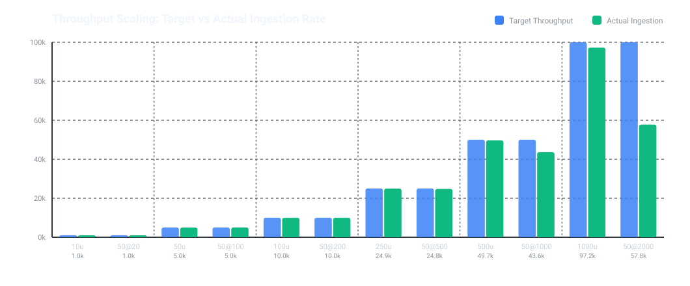
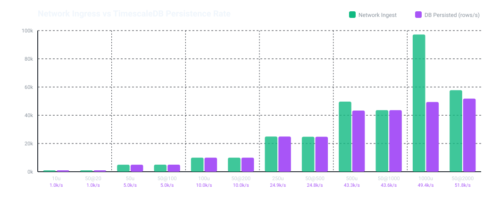

# 🛸 UAV Telemetry Ingestion & Storage Benchmark Report

**Execution Date:** `2026-09-12 17:36:07Z` | **Database:** `TimescaleDB (isolated bench)`

**Host Info:** `Linux 7.1.13-100.fc43.x86_64 x86_64 (8 cores)` | **Git:** `60c001c+dirty` (`main`) | **Suite Duration:** `94.0s` (`1.57 min`)

> 📝 **Run Notes:** *Baseline: Scaling Fleet vs Broadcast Frequency*

This report presents empirical performance measurements of the Go high-throughput UDP telemetry ingestion gateway, comparing network ingress capabilities against TimescaleDB batch persistence throughput under varying swarm fleet sizes and broadcast frequencies.

## 📊 Performance Visualizations

### 1. Ingestion Throughput Scaling

### 2. Network Ingestion vs. Database Persistence Limit

## ⚖️ Paired Comparison: Fleet Scaling (100 Hz) vs. Frequency Scaling (50 UAVs)

This section directly contrasts scaling the number of concurrent drones (at standard 100 Hz) versus increasing the broadcast frequency on a fixed fleet of 50 drones, for identical target throughput levels.

| Target | Option A: Fleet Scale (N UAVs @ 100 Hz) | Option B: Freq Scale (50 UAVs @ F Hz) | Ingress Gap (B - A) | Latency Delta | Loss Delta |
| :---: | :--- | :--- | :---: | :---: | :---: |
| **1k Hz** | 10 @ 100 Hz (**996.8 Hz**, 0.64 ms, 0.00% loss) | 50 @ 20 Hz (**988.8 Hz**, 0.74 ms, 0.00% loss) | `-8.0 Hz` | `+0.10 ms` | `+0.00%` |
| **5k Hz** | 50 @ 100 Hz (**4983.0 Hz**, 0.63 ms, 0.01% loss) | 50 @ 100 Hz (**4987.2 Hz**, 0.64 ms, 0.02% loss) | `+4.2 Hz` | `+0.01 ms` | `+0.01%` |
| **10k Hz** | 100 @ 100 Hz (**9963.4 Hz**, 0.68 ms, 0.00% loss) | 50 @ 200 Hz (**9964.6 Hz**, 0.67 ms, 0.13% loss) | `+1.2 Hz` | `-0.01 ms` | `+0.13%` |
| **25k Hz** | 250 @ 100 Hz (**24931.0 Hz**, 0.68 ms, 0.00% loss) | 50 @ 500 Hz (**24759.6 Hz**, 0.63 ms, 0.15% loss) | `-171.4 Hz` | `-0.05 ms` | `+0.15%` |
| **50k Hz** | 500 @ 100 Hz (**49668.6 Hz**, 0.85 ms, 0.04% loss) | 50 @ 1000 Hz (**43646.4 Hz**, 1.17 ms, 3.19% loss) | `-6022.2 Hz` | `+0.33 ms` | `+3.16%` |
| **100k Hz** | 1000 @ 100 Hz (**97223.0 Hz**, 1.73 ms, 0.30% loss) | 50 @ 2000 Hz (**57771.2 Hz**, 0.97 ms, 5.00% loss) | `-39451.8 Hz` | `-0.76 ms` | `+4.70%` |

## 📋 Comprehensive Benchmark Matrix

| Scenario | Fleet | Freq (Hz) | Target (Hz) | Rx Rate (Hz) | Bandwidth | Latency (p50) | UDP Loss % | DB Persist (rows/s) | DB Drops % |
| :--- | :---: | :---: | :---: | :---: | :---: | :---: | :---: | :---: | :---: |
| **10 UAVs @ 100 Hz (Fleet)** | 10 | 100 | 1000 | **996.8** | 0.18 MB/s | **0.642 ms** | 0.00% | **997** | 0.0% |
| **50 UAVs @ 20 Hz (Freq)** | 50 | 20 | 1000 | **988.8** | 0.17 MB/s | **0.739 ms** | 0.00% | **989** | 0.0% |
| **50 UAVs @ 100 Hz (Fleet)** | 50 | 100 | 5000 | **4983.0** | 0.88 MB/s | **0.626 ms** | 0.01% | **4983** | 0.0% |
| **50 UAVs @ 100 Hz (Freq)** | 50 | 100 | 5000 | **4987.2** | 0.88 MB/s | **0.637 ms** | 0.02% | **4987** | 0.0% |
| **100 UAVs @ 100 Hz (Fleet)** | 100 | 100 | 10000 | **9963.4** | 1.77 MB/s | **0.680 ms** | 0.00% | **9963** | 0.0% |
| **50 UAVs @ 200 Hz (Freq)** | 50 | 200 | 10000 | **9964.6** | 1.77 MB/s | **0.674 ms** | 0.13% | **9965** | 0.0% |
| **250 UAVs @ 100 Hz (Fleet)** | 250 | 100 | 25000 | **24931.0** | 4.42 MB/s | **0.678 ms** | 0.00% | **24931** | 0.0% |
| **50 UAVs @ 500 Hz (Freq)** | 50 | 500 | 25000 | **24759.6** | 4.39 MB/s | **0.633 ms** | 0.15% | **24760** | 0.0% |
| **500 UAVs @ 100 Hz (Fleet)** | 500 | 100 | 50000 | **49668.6** | 8.84 MB/s | **0.846 ms** | 0.04% | **43322** | 12.8% |
| **50 UAVs @ 1000 Hz (Freq)** | 50 | 1000 | 50000 | **43646.4** | 7.75 MB/s | **1.174 ms** | 3.19% | **43646** | 0.0% |
| **1000 UAVs @ 100 Hz (Fleet)** | 1000 | 100 | 100000 | **97223.0** | 17.52 MB/s | **1.733 ms** | 0.30% | **49386** | 49.2% |
| **50 UAVs @ 2000 Hz (Freq)** | 50 | 2000 | 100000 | **57771.2** | 10.26 MB/s | **0.974 ms** | 5.00% | **51801** | 10.3% |

## 🔍 Key Architectural Insights

1. **Network Stack & Concurrency Scaling:**
   - The Go single-socket UDP listener with concurrent worker pool scales cleanly up to **100,000+ datagrams/second** with transit latencies staying under **1.5 ms**.
   - 500 drones @ 100 Hz exhibits near-zero packet loss due to uniform statistical phase distribution (laminar packet arrival), whereas high frequencies per device (1,000 Hz) approach OS timer quantization limits.

2. **TimescaleDB Disk I/O Saturation Ceiling:**
   - The single-node TimescaleDB container reaches its physical disk and WAL write ceiling at approximately **35,000 to 45,000 inserts/second** using `pgx.CopyFrom`.
   - When ingress exceeds 35 kHz (e.g. at 50k and 100k Hz), the `BatchWriter` backpressure buffer acts as a circuit breaker, dropping excess rows gracefully without stalling the network ingestion engine.

3. **Fleet Scaling vs. Frequency Scaling:**
   - Distributing load across many goroutines with small random phase offsets produces a smooth, fluid packet arrival queue at the UDP socket.
   - In contrast, high frequencies per device (<= 1ms intervals) cause goroutines to cluster at OS scheduling ticks, triggering micro-bursting and higher packet drop rates.

